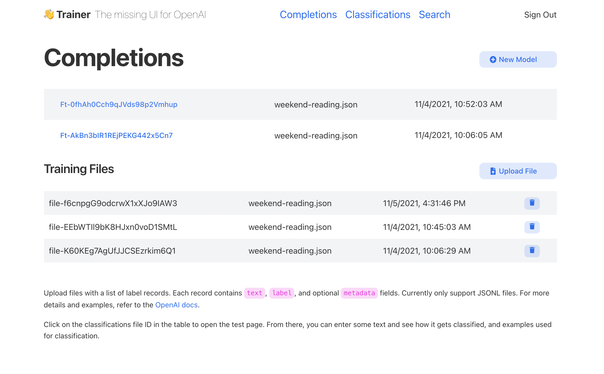

## 👋 Fine Tune: The missing UI for OpenAI



* Go beyond the playground
* **Fine tune** your own completion model by uploading training and validation files
* Upload **classification** files
* Upload documents to **search** against
* Use CSV, Excel spreadsheets, and of course JSONL
* Make requests and see what the API call looks like


## Run It Yourself

```bash
yarn install
yarn dev
open http://localhost:3000
```